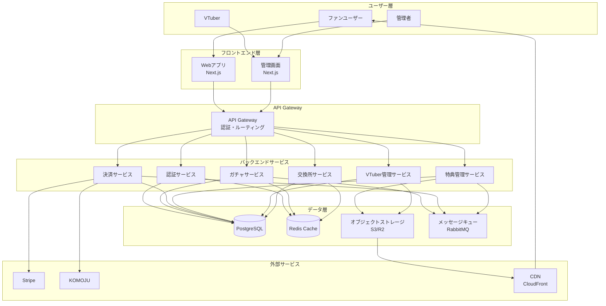
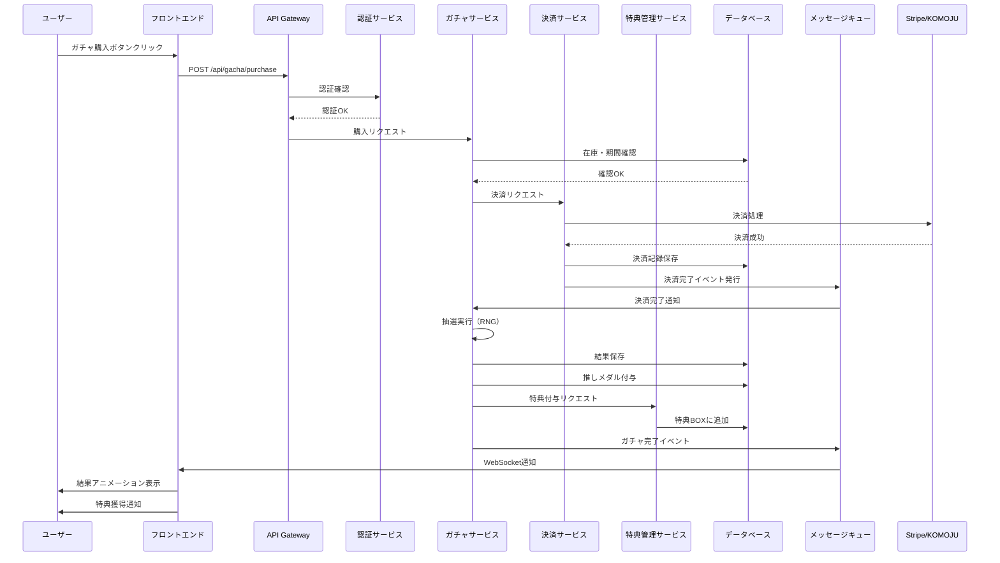
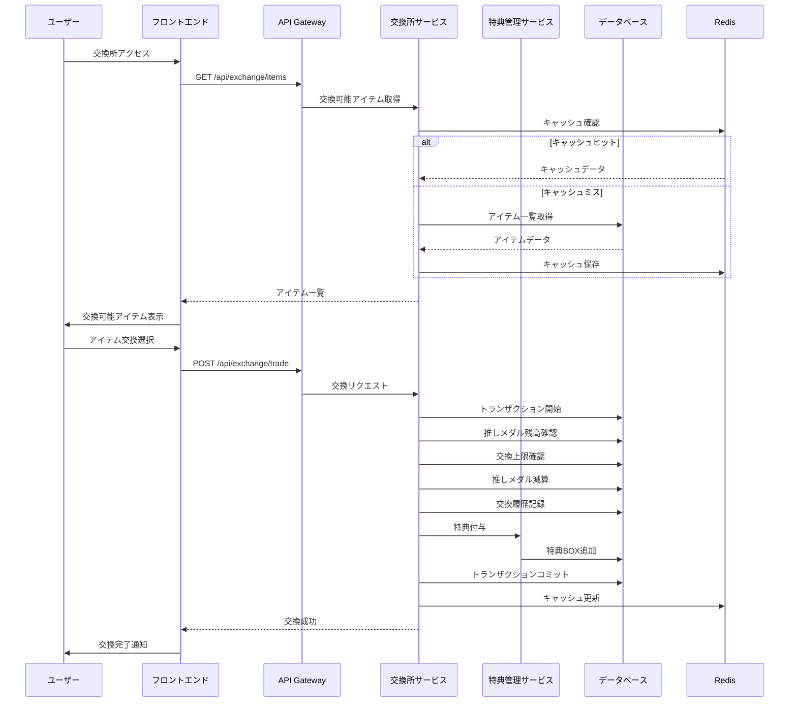
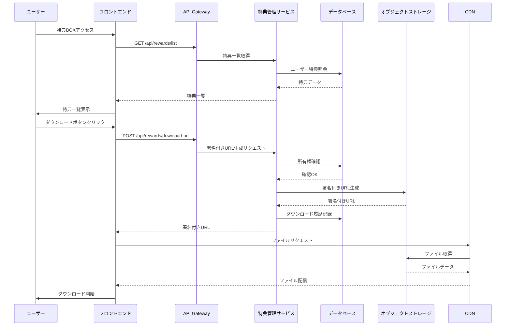
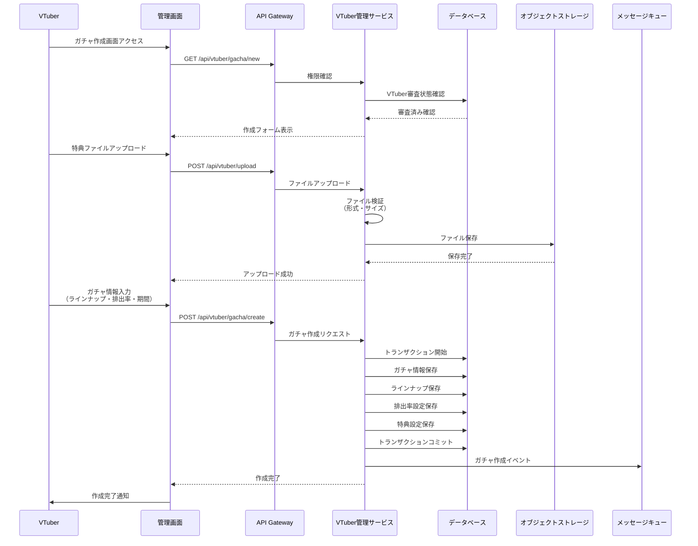
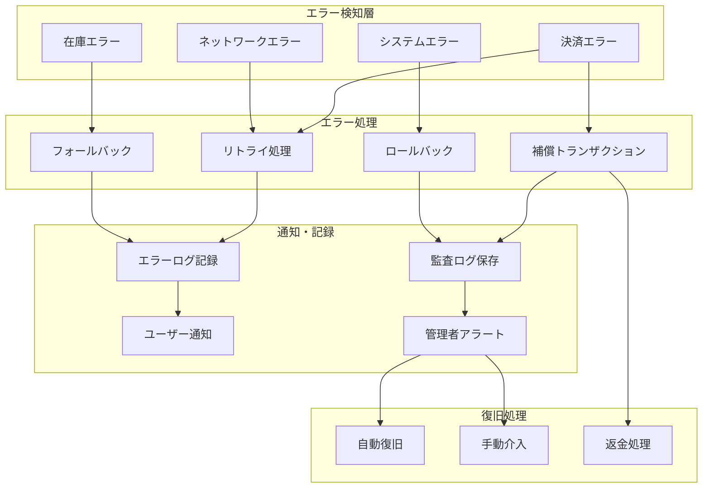
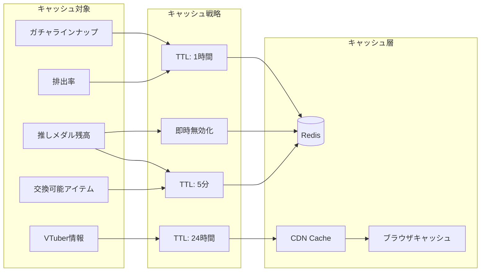
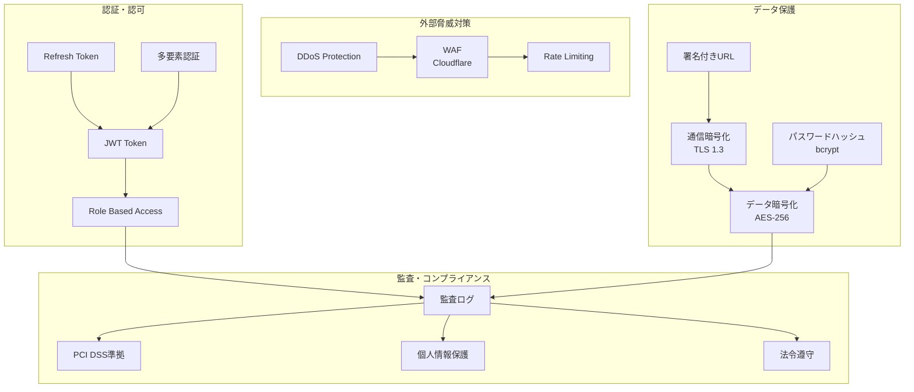

# データフロー図

## システム全体のデータフロー

```mermaid
flowchart TB
    subgraph "ユーザー層"
        U[ファンユーザー]
        V[VTuber]
        A[管理者]
    end
    
    subgraph "フロントエンド層"
        WEB[Webアプリ<br/>Next.js]
        ADMIN[管理画面<br/>Next.js]
    end
    
    subgraph "API Gateway"
        GW[API Gateway<br/>認証・ルーティング]
    end
    
    subgraph "バックエンドサービス"
        AUTH[認証サービス]
        GACHA[ガチャサービス]
        PAY[決済サービス]
        REWARD[特典管理サービス]
        VTUBER[VTuber管理サービス]
        EXCHANGE[交換所サービス]
    end
    
    subgraph "データ層"
        DB[(PostgreSQL)]
        REDIS[(Redis Cache)]
        S3[オブジェクトストレージ<br/>S3/R2]
        MQ[メッセージキュー<br/>RabbitMQ]
    end
    
    subgraph "外部サービス"
        STRIPE[Stripe]
        KOMOJU[KOMOJU]
        CDN[CDN<br/>CloudFront]
    end
    
    U --> WEB
    V --> ADMIN
    A --> ADMIN
    
    WEB --> GW
    ADMIN --> GW
    
    GW --> AUTH
    GW --> GACHA
    GW --> PAY
    GW --> REWARD
    GW --> VTUBER
    GW --> EXCHANGE
    
    AUTH --> DB
    AUTH --> REDIS
    
    GACHA --> DB
    GACHA --> REDIS
    GACHA --> MQ
    
    PAY --> STRIPE
    PAY --> KOMOJU
    PAY --> DB
    PAY --> MQ
    
    REWARD --> DB
    REWARD --> S3
    REWARD --> MQ
    
    VTUBER --> DB
    VTUBER --> S3
    
    EXCHANGE --> DB
    EXCHANGE --> REDIS
    
    S3 --> CDN
    CDN --> U
```

## ガチャ購入フロー

```mermaid
sequenceDiagram
    participant U as ユーザー
    participant F as フロントエンド
    participant GW as API Gateway
    participant AUTH as 認証サービス
    participant GACHA as ガチャサービス
    participant PAY as 決済サービス
    participant REWARD as 特典管理サービス
    participant DB as データベース
    participant MQ as メッセージキュー
    participant STRIPE as Stripe/KOMOJU
    
    U->>F: ガチャ購入ボタンクリック
    F->>GW: POST /api/gacha/purchase
    GW->>AUTH: 認証確認
    AUTH-->>GW: 認証OK
    
    GW->>GACHA: 購入リクエスト
    GACHA->>DB: 在庫・期間確認
    DB-->>GACHA: 確認OK
    
    GACHA->>PAY: 決済リクエスト
    PAY->>STRIPE: 決済処理
    STRIPE-->>PAY: 決済成功
    PAY->>DB: 決済記録保存
    
    PAY->>MQ: 決済完了イベント発行
    MQ->>GACHA: 決済完了通知
    
    GACHA->>GACHA: 抽選実行（RNG）
    GACHA->>DB: 結果保存
    GACHA->>DB: 推しメダル付与
    
    GACHA->>REWARD: 特典付与リクエスト
    REWARD->>DB: 特典BOXに追加
    
    GACHA->>MQ: ガチャ完了イベント
    MQ->>F: WebSocket通知
    
    F->>U: 結果アニメーション表示
    F->>U: 特典獲得通知
```

## 推しメダル交換フロー

```mermaid
sequenceDiagram
    participant U as ユーザー
    participant F as フロントエンド
    participant GW as API Gateway
    participant EXCHANGE as 交換所サービス
    participant REWARD as 特典管理サービス
    participant DB as データベース
    participant REDIS as Redis
    
    U->>F: 交換所アクセス
    F->>GW: GET /api/exchange/items
    GW->>EXCHANGE: 交換可能アイテム取得
    EXCHANGE->>REDIS: キャッシュ確認
    
    alt キャッシュヒット
        REDIS-->>EXCHANGE: キャッシュデータ
    else キャッシュミス
        EXCHANGE->>DB: アイテム一覧取得
        DB-->>EXCHANGE: アイテムデータ
        EXCHANGE->>REDIS: キャッシュ保存
    end
    
    EXCHANGE-->>F: アイテム一覧
    F->>U: 交換可能アイテム表示
    
    U->>F: アイテム交換選択
    F->>GW: POST /api/exchange/trade
    GW->>EXCHANGE: 交換リクエスト
    
    EXCHANGE->>DB: トランザクション開始
    EXCHANGE->>DB: 推しメダル残高確認
    EXCHANGE->>DB: 交換上限確認
    EXCHANGE->>DB: 推しメダル減算
    EXCHANGE->>DB: 交換履歴記録
    
    EXCHANGE->>REWARD: 特典付与
    REWARD->>DB: 特典BOX追加
    
    EXCHANGE->>DB: トランザクションコミット
    EXCHANGE->>REDIS: キャッシュ更新
    
    EXCHANGE-->>F: 交換成功
    F->>U: 交換完了通知
```

## 特典ダウンロードフロー

```mermaid
sequenceDiagram
    participant U as ユーザー
    participant F as フロントエンド
    participant GW as API Gateway
    participant REWARD as 特典管理サービス
    participant DB as データベース
    participant S3 as オブジェクトストレージ
    participant CDN as CDN
    
    U->>F: 特典BOXアクセス
    F->>GW: GET /api/rewards/list
    GW->>REWARD: 特典一覧取得
    REWARD->>DB: ユーザー特典照会
    DB-->>REWARD: 特典データ
    REWARD-->>F: 特典一覧
    F->>U: 特典一覧表示
    
    U->>F: ダウンロードボタンクリック
    F->>GW: POST /api/rewards/download-url
    GW->>REWARD: 署名付きURL生成リクエスト
    
    REWARD->>DB: 所有権確認
    DB-->>REWARD: 確認OK
    
    REWARD->>S3: 署名付きURL生成
    S3-->>REWARD: 署名付きURL
    
    REWARD->>DB: ダウンロード履歴記録
    
    REWARD-->>F: 署名付きURL
    F->>CDN: ファイルリクエスト
    CDN->>S3: ファイル取得
    S3-->>CDN: ファイルデータ
    CDN-->>F: ファイル配信
    F->>U: ダウンロード開始
```

## VTuberガチャ作成フロー

```mermaid
sequenceDiagram
    participant V as VTuber
    participant ADMIN as 管理画面
    participant GW as API Gateway
    participant VTUBER as VTuber管理サービス
    participant DB as データベース
    participant S3 as オブジェクトストレージ
    participant MQ as メッセージキュー
    
    V->>ADMIN: ガチャ作成画面アクセス
    ADMIN->>GW: GET /api/vtuber/gacha/new
    GW->>VTUBER: 権限確認
    VTUBER->>DB: VTuber審査状態確認
    DB-->>VTUBER: 審査済み確認
    VTUBER-->>ADMIN: 作成フォーム表示
    
    V->>ADMIN: 特典ファイルアップロード
    ADMIN->>GW: POST /api/vtuber/upload
    GW->>VTUBER: ファイルアップロード
    VTUBER->>VTUBER: ファイル検証<br/>（形式・サイズ）
    VTUBER->>S3: ファイル保存
    S3-->>VTUBER: 保存完了
    VTUBER-->>ADMIN: アップロード成功
    
    V->>ADMIN: ガチャ情報入力<br/>（ラインナップ・排出率・期間）
    ADMIN->>GW: POST /api/vtuber/gacha/create
    GW->>VTUBER: ガチャ作成リクエスト
    
    VTUBER->>DB: トランザクション開始
    VTUBER->>DB: ガチャ情報保存
    VTUBER->>DB: ラインナップ保存
    VTUBER->>DB: 排出率設定保存
    VTUBER->>DB: 特典設定保存
    VTUBER->>DB: トランザクションコミット
    
    VTUBER->>MQ: ガチャ作成イベント
    
    VTUBER-->>ADMIN: 作成完了
    ADMIN->>V: 作成完了通知
```

## エラーハンドリングフロー

```mermaid
flowchart TB
    subgraph "エラー検知層"
        E1[決済エラー]
        E2[在庫エラー]
        E3[システムエラー]
        E4[ネットワークエラー]
    end
    
    subgraph "エラー処理"
        H1[リトライ処理]
        H2[フォールバック]
        H3[補償トランザクション]
        H4[ロールバック]
    end
    
    subgraph "通知・記録"
        L1[エラーログ記録]
        L2[監査ログ保存]
        N1[ユーザー通知]
        N2[管理者アラート]
    end
    
    subgraph "復旧処理"
        R1[自動復旧]
        R2[手動介入]
        R3[返金処理]
    end
    
    E1 --> H1
    E1 --> H3
    E2 --> H2
    E3 --> H4
    E4 --> H1
    
    H1 --> L1
    H2 --> L1
    H3 --> L2
    H4 --> L2
    
    L1 --> N1
    L2 --> N2
    
    N2 --> R1
    N2 --> R2
    H3 --> R3
```

## キャッシング戦略

```mermaid
flowchart LR
    subgraph "キャッシュ対象"
        C1[ガチャラインナップ]
        C2[排出率]
        C3[推しメダル残高]
        C4[交換可能アイテム]
        C5[VTuber情報]
    end
    
    subgraph "キャッシュ層"
        REDIS[(Redis)]
        CDN[CDN Cache]
        BROWSER[ブラウザキャッシュ]
    end
    
    subgraph "キャッシュ戦略"
        S1[TTL: 5分]
        S2[TTL: 1時間]
        S3[TTL: 24時間]
        S4[即時無効化]
    end
    
    C1 --> S2
    C2 --> S2
    C3 --> S1
    C3 --> S4
    C4 --> S1
    C5 --> S3
    
    S1 --> REDIS
    S2 --> REDIS
    S3 --> CDN
    S4 --> REDIS
    
    CDN --> BROWSER
```

## セキュリティフロー

```mermaid
flowchart TB
    subgraph "外部脅威対策"
        WAF[WAF<br/>Cloudflare]
        DDoS[DDoS Protection]
        RATE[Rate Limiting]
    end
    
    subgraph "認証・認可"
        JWT[JWT Token]
        REFRESH[Refresh Token]
        RBAC[Role Based Access]
        MFA[多要素認証]
    end
    
    subgraph "データ保護"
        ENC1[通信暗号化<br/>TLS 1.3]
        ENC2[データ暗号化<br/>AES-256]
        HASH[パスワードハッシュ<br/>bcrypt]
        SIGN[署名付きURL]
    end
    
    subgraph "監査・コンプライアンス"
        AUDIT[監査ログ]
        PCI[PCI DSS準拠]
        PRIVACY[個人情報保護]
        LAW[法令遵守]
    end
    
    WAF --> RATE
    DDoS --> WAF
    
    JWT --> RBAC
    REFRESH --> JWT
    MFA --> JWT
    
    ENC1 --> ENC2
    HASH --> ENC2
    SIGN --> ENC1
    
    RBAC --> AUDIT
    ENC2 --> AUDIT
    AUDIT --> PCI
    AUDIT --> PRIVACY
    AUDIT --> LAW
```