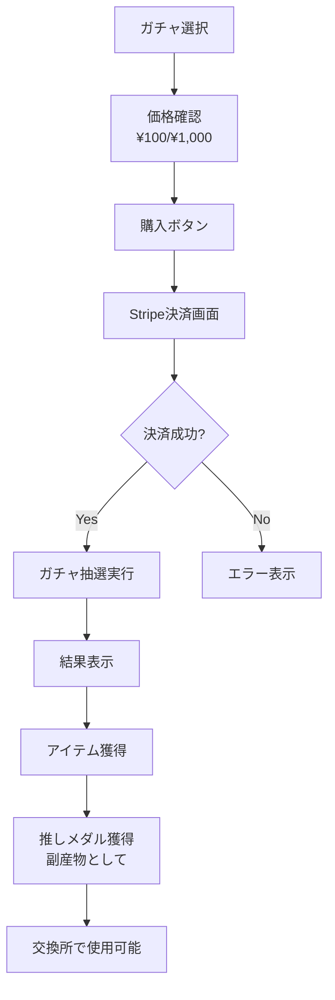

# TASK-507: 決済フロー修正 - メダル購入システムの削除

## 🎯 概要
現在の実装ではメダルを購入してガチャを引く仕様になっているが、正しい仕様は「ガチャを直接課金で購入し、結果としてメダルを獲得する」システムである。この修正タスクで正しい決済フローに修正する。

## 🚨 問題点
1. **間違った仕様**: メダルを購入してガチャを引く
2. **正しい仕様**: ガチャを直接購入（100円/1000円）し、メダルは副産物として獲得

## 📋 修正対象ファイル

### フロントエンド修正
- [ ] `client/src/stores/gacha.ts` - executeDraw関数の修正
- [ ] `client/src/stores/medal.ts` - メダル購入機能の削除
- [ ] `client/src/types/gacha.ts` - 型定義の修正
- [ ] `client/src/types/medal.ts` - メダル購入関連の型削除
- [ ] `client/src/components/gacha/GachaDrawPage.tsx` - UI修正
- [ ] `client/src/components/gacha/GachaDetailPage.tsx` - 価格表示修正

### バックエンド修正
- [ ] `src/gacha/gacha.service.ts` - 決済処理の修正
- [ ] `src/payment/payment.service.ts` - Stripe統合の実装
- [ ] `src/medal/medal.service.ts` - メダル獲得ロジックの修正

### ドキュメント修正
- [ ] `docs/design/requirements.md` - 要件定義書の修正
- [ ] `docs/design/api-endpoints.md` - APIエンドポイント仕様の修正
- [ ] `docs/design/database-schema.sql` - データベーススキーマの修正

## 🔧 実装詳細

### 1. ガチャストアの修正

#### Before (間違った実装)
```typescript
// stores/gacha.ts
executeDraw: async (gachaId: string, count: number) => {
  // メダルを消費してガチャを引く
  const medalCost = count === 1 ? baseGacha.singlePrice : baseGacha.tenDrawPrice
  
  if (!checkSufficientBalance(medalCost)) {
    throw new Error('メダルが不足しています')
  }
  
  // ガチャ実行
  const response = await apiClient.post('/api/gacha/draw', {
    gachaId,
    count,
    useTicket: false  // メダル使用
  })
}
```

#### After (正しい実装)
```typescript
// stores/gacha.ts
executeDraw: async (gachaId: string, count: number) => {
  set({ drawState: 'payment' })
  
  try {
    // 1. Stripe決済処理
    const paymentAmount = count === 1 ? 100 : 1000  // 円
    const payment = await processStripePayment({
      amount: paymentAmount,
      currency: 'jpy',
      description: `${gachaName} ${count === 1 ? '単発' : '10連'}ガチャ`,
      metadata: { gachaId, count, userId: currentUser.id }
    })
    
    if (!payment.success) {
      throw new Error('決済に失敗しました')
    }
    
    // 2. 決済成功後、ガチャ抽選実行
    set({ drawState: 'drawing' })
    const response = await apiClient.post('/api/gacha/draw', {
      gachaId,
      count,
      paymentIntentId: payment.id
    })
    
    // 3. 結果処理（メダルは獲得物として含まれる）
    const result = response.data
    set({
      drawResult: {
        id: result.id,
        items: result.items,
        medalsEarned: result.medalsEarned,  // 獲得メダル
        paymentId: payment.id,
        timestamp: new Date()
      },
      drawState: 'complete'
    })
    
    // 4. メダル残高を更新（獲得分を追加）
    await updateMedalBalance(result.medalsEarned)
    
  } catch (error) {
    set({ 
      drawState: 'error',
      drawError: error.message 
    })
  }
}
```

### 2. メダルストアの修正

#### Before
```typescript
// stores/medal.ts
export interface MedalStore {
  purchaseMedals: (amount: number) => Promise<void>  // 削除対象
  useMedals: (amount: number) => Promise<void>       // 削除対象
  // ...
}
```

#### After
```typescript
// stores/medal.ts
export interface MedalStore {
  // メダルは獲得・交換のみ
  earnMedals: (amount: number, source: string) => Promise<void>
  exchangeMedals: (itemId: string, cost: number) => Promise<void>
  // ...
}
```

### 3. 型定義の修正

#### DrawResult型の修正
```typescript
// types/gacha.ts
export interface DrawResult {
  id: string
  gachaId: string
  items: DrawResultItem[]
  medalsEarned: number      // 追加: 獲得メダル数
  paymentId: string         // 追加: Stripe決済ID
  paymentAmount: number     // 追加: 支払金額（円）
  drawCount: number
  timestamp: string
  // medalUsed: number      // 削除: メダル消費は無し
}
```

### 4. UI/UXの修正

#### ガチャ詳細画面
```tsx
// GachaDetailPage.tsx
<div className="price-display">
  {/* Before: メダル価格表示 */}
  {/* <p>単発: {gacha.singlePrice} メダル</p> */}
  
  {/* After: 円価格表示 */}
  <p>単発: ¥100</p>
  <p>10連: ¥1,000</p>
</div>

<Button onClick={handlePurchase}>
  {/* Before: メダルで購入 */}
  {/* After: 直接購入 */}
  {count === 1 ? '¥100で購入' : '¥1,000で10連購入'}
</Button>
```

### 5. 決済フローの変更



## 📝 テスト要件

### 単体テスト
- [ ] Stripe決済処理のモックテスト
- [ ] ガチャ抽選ロジックテスト
- [ ] メダル獲得計算テスト

### 統合テスト
- [ ] 決済→抽選→メダル獲得の一連フロー
- [ ] エラーハンドリング（決済失敗時）
- [ ] メダル残高更新の確認

### E2Eテスト
- [ ] ユーザー視点での購入フロー全体
- [ ] 決済キャンセル時の動作
- [ ] メダル獲得後の交換所での使用

## 🚀 実装手順

1. **Phase 1: バックエンド修正**
   - Stripe決済サービスの実装
   - APIエンドポイントの修正
   - データベーススキーマの更新

2. **Phase 2: フロントエンド修正**
   - ストアの修正
   - UIコンポーネントの更新
   - 型定義の修正

3. **Phase 3: テスト・検証**
   - 単体テスト実行
   - 統合テスト実行
   - 決済フローの動作確認

4. **Phase 4: ドキュメント更新**
   - 要件定義書の修正
   - API仕様書の更新
   - データベース設計書の修正

## ⚠️ 注意事項

1. **後方互換性**: 既存のメダル残高は交換所で引き続き使用可能にする
2. **データ移行**: メダル購入履歴がある場合は適切に処理
3. **セキュリティ**: Stripe Webhookの実装時は署名検証必須
4. **エラー処理**: 決済失敗時の適切なロールバック処理

## 完了条件

- [ ] ガチャが直接課金（¥100/¥1,000）で購入可能
- [ ] メダルは購入できない（ガチャの結果として獲得のみ）
- [ ] 獲得したメダルは交換所でのみ使用可能
- [ ] Stripe決済が正常に動作
- [ ] 全テストが通過
- [ ] ドキュメントが更新済み