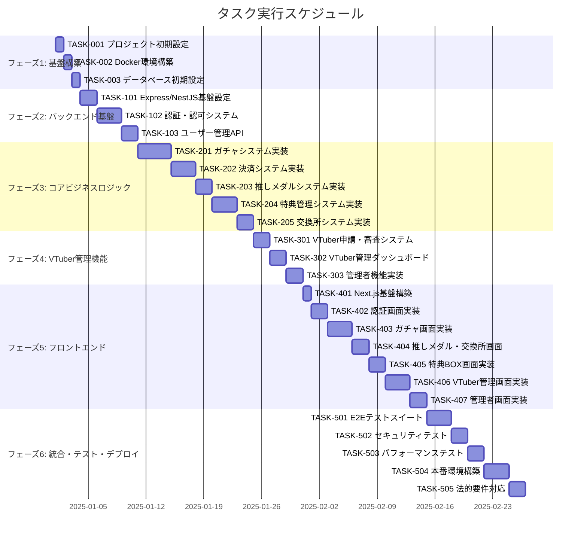

# こえポン！（Koepon!） 実装タスク

## 概要

全タスク数: 46
推定作業時間: 160時間
クリティカルパス: TASK-001 → TASK-002 → TASK-003 → TASK-101 → TASK-201 → TASK-301 → TASK-401

## タスク一覧

### フェーズ1: 基盤構築

#### TASK-001: プロジェクト初期設定

- [x] **タスク完了**
- **タスクタイプ**: DIRECT
- **要件リンク**: 全体的な要件
- **依存タスク**: なし
- **実装詳細**:
  - Node.js/TypeScript プロジェクト初期化
  - ESLint + Prettier設定
  - package.json設定
  - Git設定とgitignore
  - ディレクトリ構造作成
- **テスト要件**:
  - [ ] プロジェクト起動テスト
  - [ ] Lint/Format動作確認
- **完了条件**:
  - [ ] TypeScriptがコンパイル可能
  - [ ] Lintエラーなし
  - [ ] ディレクトリ構造が整備されている

#### TASK-002: Docker環境構築

- [x] **タスク完了**
- **タスクタイプ**: DIRECT
- **要件リンク**: NFR-001, REQ-401
- **依存タスク**: TASK-001
- **実装詳細**:
  - PostgreSQL 15コンテナ設定
  - Redisコンテナ設定
  - docker-compose.yml作成
  - 開発用環境変数設定
- **テスト要件**:
  - [ ] PostgreSQL接続テスト
  - [ ] Redis接続テスト
  - [ ] コンテナ自動起動テスト
- **完了条件**:
  - [ ] すべてのコンテナが正常起動
  - [ ] データベース接続確立
  - [ ] 環境変数が正しく読み込まれる

#### TASK-003: データベース初期設定

- [ ] **タスク完了**
- **タスクタイプ**: DIRECT
- **要件リンク**: すべてのエンティティ要件
- **依存タスク**: TASK-002
- **実装詳細**:
  - database-schema.sqlの実行
  - マイグレーション機能実装
  - シードデータ作成
  - テスト用データベース設定
- **テスト要件**:
  - [ ] スキーマ作成テスト
  - [ ] マイグレーション動作テスト
  - [ ] データ整合性テスト
- **完了条件**:
  - [ ] 全テーブルが作成されている
  - [ ] インデックスが設定されている
  - [ ] 制約が正しく適用されている

### フェーズ2: バックエンド基盤

#### TASK-101: Express/NestJS基盤設定

- [ ] **タスク完了**
- **タスクタイプ**: DIRECT
- **要件リンク**: NFR-103, NFR-105-107
- **依存タスク**: TASK-003
- **実装詳細**:
  - NestJSプロジェクト初期化
  - データベース接続設定
  - 環境変数管理
  - ログ設定
  - ヘルスチェックエンドポイント
  - セキュリティミドルウェア設定
- **テスト要件**:
  - [ ] サーバー起動テスト
  - [ ] ヘルスチェック動作テスト
  - [ ] セキュリティヘッダー確認テスト
- **完了条件**:
  - [ ] サーバーが正常起動
  - [ ] データベース接続確立
  - [ ] 基本セキュリティ対策が有効

#### TASK-102: 認証・認可システム

- [ ] **タスク完了**
- **タスクタイプ**: TDD
- **要件リンク**: REQ-201, NFR-102, NFR-103
- **依存タスク**: TASK-101
- **実装詳細**:
  - JWT認証実装
  - Refresh token機能
  - パスワードハッシュ化
  - セッション管理
  - 認証ミドルウェア
  - 権限チェック機能
- **単体テスト要件**:
  - [ ] JWT生成・検証テスト
  - [ ] パスワードハッシュテスト
  - [ ] セッション管理テスト
  - [ ] 権限チェックテスト
- **統合テスト要件**:
  - [ ] ログインフローテスト
  - [ ] トークンリフレッシュテスト
  - [ ] 認証失敗テスト
- **エラーハンドリング**:
  - [ ] 無効な認証情報
  - [ ] トークン期限切れ
  - [ ] 権限不足エラー

#### TASK-103: ユーザー管理API

- [ ] **タスク完了**
- **タスクタイプ**: TDD
- **要件リンク**: REQ-001基本機能, NFR-106
- **依存タスク**: TASK-102
- **実装詳細**:
  - ユーザー登録API
  - ユーザー情報取得・更新API
  - プロフィール画像アップロード
  - 入力値バリデーション
  - XSS対策
- **単体テスト要件**:
  - [ ] ユーザーCRUD操作テスト
  - [ ] バリデーションテスト
  - [ ] XSS対策テスト
- **統合テスト要件**:
  - [ ] ユーザー登録フローテスト
  - [ ] プロフィール更新テスト
- **エラーハンドリング**:
  - [ ] 重複メールアドレス
  - [ ] 無効な入力値
  - [ ] ファイルサイズ制限

### フェーズ3: コアビジネスロジック実装

#### TASK-201: ガチャシステム実装

- [ ] **タスク完了**
- **タスクタイプ**: TDD
- **要件リンク**: REQ-001, REQ-008, REQ-101, NFR-002
- **依存タスク**: TASK-103
- **実装詳細**:
  - ガチャ作成・管理API
  - 抽選アルゴリズム実装
  - 排出率計算・検証
  - 結果記録・履歴管理
  - パフォーマンス最適化（3秒以内）
- **単体テスト要件**:
  - [ ] 抽選アルゴリズムテスト
  - [ ] 排出率検証テスト
  - [ ] エッジケーステスト（境界値）
- **統合テスト要件**:
  - [ ] ガチャ作成フローテスト
  - [ ] 抽選実行テスト
  - [ ] パフォーマンステスト
- **エラーハンドリング**:
  - [ ] 排出率不正値
  - [ ] 抽選処理失敗
  - [ ] タイムアウト処理

#### TASK-202: 決済システム実装

- [ ] **タスク完了**
- **タスクタイプ**: TDD
- **要件リンク**: REQ-101, REQ-401, REQ-409, REQ-204
- **依存タスク**: TASK-201
- **実装詳細**:
  - Stripe決済連携
  - 冪等性キー実装
  - Webhook処理
  - 決済状態管理
  - 重複決済防止
  - 返金処理
- **単体テスト要件**:
  - [ ] Stripe API連携テスト
  - [ ] 冪等性キーテスト
  - [ ] Webhook処理テスト
- **統合テスト要件**:
  - [ ] 決済フローテスト
  - [ ] 重複決済防止テスト
  - [ ] 失敗時処理テスト
- **エラーハンドリング**:
  - [ ] 決済失敗
  - [ ] Webhook失敗
  - [ ] 重複決済

#### TASK-203: 推しメダルシステム実装

- [ ] **タスク完了**
- **タスクタイプ**: TDD
- **要件リンク**: REQ-002, REQ-003, REQ-102
- **依存タスク**: TASK-202
- **実装詳細**:
  - 推しメダル付与ロジック
  - 残高管理
  - トランザクション記録
  - VTuber別管理
  - 残高確認API
- **単体テスト要件**:
  - [ ] メダル付与テスト
  - [ ] 残高計算テスト
  - [ ] トランザクションテスト
- **統合テスト要件**:
  - [ ] ガチャ連携テスト
  - [ ] 残高更新テスト
- **エラーハンドリング**:
  - [ ] 残高不足
  - [ ] 不正な操作
  - [ ] データ整合性エラー

#### TASK-204: 特典管理システム実装

- [ ] **タスク完了**
- **タスクタイプ**: TDD
- **要件リンク**: REQ-005, REQ-006, REQ-010, REQ-403, NFR-003
- **依存タスク**: TASK-203
- **実装詳細**:
  - ファイルアップロード機能
  - S3/R2連携
  - 署名付きURL生成
  - 特典BOX実装
  - ファイル形式検証
  - ダウンロード履歴管理
- **単体テスト要件**:
  - [ ] ファイル検証テスト
  - [ ] 署名付きURL生成テスト
  - [ ] ダウンロード制御テスト
- **統合テスト要件**:
  - [ ] アップロードフローテスト
  - [ ] ダウンロードフローテスト
  - [ ] パフォーマンステスト（5秒以内）
- **エラーハンドリング**:
  - [ ] 不正ファイル形式
  - [ ] ファイルサイズ制限
  - [ ] ストレージエラー

#### TASK-205: 交換所システム実装

- [ ] **タスク完了**
- **タスクタイプ**: TDD
- **要件リンク**: REQ-004, REQ-105, REQ-203
- **依存タスク**: TASK-204
- **実装詳細**:
  - 交換アイテム管理
  - 交換処理実装
  - 上限チェック
  - 期間制限
  - 交換履歴管理
- **単体テスト要件**:
  - [ ] 交換ロジックテスト
  - [ ] 上限チェックテスト
  - [ ] 期間制限テスト
- **統合テスト要件**:
  - [ ] 交換フローテスト
  - [ ] 制限チェックテスト
- **エラーハンドリング**:
  - [ ] 残高不足
  - [ ] 上限達成
  - [ ] 期間外交換

### フェーズ4: VTuber管理機能

#### TASK-301: VTuber申請・審査システム

- [ ] **タスク完了**
- **タスクタイプ**: TDD
- **要件リンク**: REQ-205, REQ-009
- **依存タスク**: TASK-205
- **実装詳細**:
  - VTuber申請API
  - 審査管理システム
  - ステータス管理
  - 通知機能
  - 専用ページ生成
- **単体テスト要件**:
  - [ ] 申請処理テスト
  - [ ] ステータス管理テスト
  - [ ] 通知機能テスト
- **統合テスト要件**:
  - [ ] 申請フローテスト
  - [ ] 審査フローテスト
- **エラーハンドリング**:
  - [ ] 重複申請
  - [ ] 不正な申請内容
  - [ ] 審査エラー

#### TASK-302: VTuber管理ダッシュボードAPI

- [ ] **タスク完了**
- **タスクタイプ**: TDD
- **要件リンク**: REQ-103, レポート機能
- **依存タスク**: TASK-301
- **実装詳細**:
  - 売上統計API
  - ガチャ管理API
  - 特典設定API
  - 分析データAPI
- **単体テスト要件**:
  - [ ] 統計計算テスト
  - [ ] データ集計テスト
- **統合テスト要件**:
  - [ ] ダッシュボードデータテスト
- **エラーハンドリング**:
  - [ ] データ取得エラー
  - [ ] 権限エラー

#### TASK-303: 管理者機能実装

- [ ] **タスク完了**
- **タスクタイプ**: TDD
- **要件リンク**: 管理者要件
- **依存タスク**: TASK-302
- **実装詳細**:
  - 管理者ダッシュボードAPI
  - システム監視機能
  - ユーザー管理機能
  - 監査ログ機能
- **単体テスト要件**:
  - [ ] 管理者権限テスト
  - [ ] 監査ログテスト
- **統合テスト要件**:
  - [ ] 管理機能テスト
- **エラーハンドリング**:
  - [ ] 権限不足
  - [ ] システムエラー

### フェーズ5: フロントエンド実装

#### TASK-401: Next.js基盤構築

- [ ] **タスク完了**
- **タスクタイプ**: DIRECT
- **要件リンク**: NFR-201, NFR-204
- **依存タスク**: TASK-303
- **実装詳細**:
  - Next.js 14 (App Router)セットアップ
  - Tailwind CSS設定
  - shadcn/ui設定
  - Zustand + TanStack Query設定
  - レスポンシブデザイン基盤
- **テスト要件**:
  - [ ] Next.js起動テスト
  - [ ] ルーティングテスト
  - [ ] レスポンシブテスト
- **完了条件**:
  - [ ] 開発サーバー正常起動
  - [ ] UI コンポーネント動作
  - [ ] モバイル対応確認

#### TASK-402: 認証画面実装

- [ ] **タスク完了**
- **タスクタイプ**: TDD
- **要件リンク**: REQ-201, NFR-201
- **依存タスク**: TASK-401
- **実装詳細**:
  - ログイン画面
  - ユーザー登録画面
  - パスワードリセット画面
  - フォームバリデーション
  - エラー表示
- **UI/UX要件**:
  - [ ] ローディング状態: ボタン無効化 + スピナー表示
  - [ ] エラー表示: フィールド下にエラーメッセージ
  - [ ] モバイル対応: タッチフレンドリーなボタンサイズ
  - [ ] アクセシビリティ: ARIA属性、キーボードナビゲーション
- **テスト要件**:
  - [ ] コンポーネント単体テスト
  - [ ] フォームバリデーションテスト
  - [ ] E2Eテスト: ログインフロー
  - [ ] アクセシビリティテスト
- **エラーハンドリング**:
  - [ ] ネットワークエラー表示
  - [ ] バリデーションエラー表示
  - [ ] サーバーエラー表示

#### TASK-403: ガチャ画面実装

- [ ] **タスク完了**
- **タスクタイプ**: TDD
- **要件リンク**: REQ-001, REQ-007, NFR-202
- **依存タスク**: TASK-402
- **実装詳細**:
  - ガチャ一覧画面
  - ガチャ詳細画面
  - 抽選実行画面
  - 結果アニメーション
  - 排出率表示
  - Socket.io連携
- **UI/UX要件**:
  - [ ] ローディング状態: 抽選中のアニメーション
  - [ ] エラー表示: モーダルでエラー内容表示
  - [ ] モバイル対応: タッチジェスチャー対応
  - [ ] アクセシビリティ: 結果の音声読み上げ対応
  - [ ] 演出: 魅力的な抽選アニメーション（3秒以内）
- **テスト要件**:
  - [ ] コンポーネント単体テスト
  - [ ] WebSocket通信テスト
  - [ ] アニメーションテスト
  - [ ] E2Eテスト: 抽選フロー
- **エラーハンドリング**:
  - [ ] 決済エラー表示
  - [ ] 抽選失敗時の処理
  - [ ] 接続エラー表示

#### TASK-404: 推しメダル・交換所画面実装

- [ ] **タスク完了**
- **タスクタイプ**: TDD
- **要件リンク**: REQ-003, REQ-004
- **依存タスク**: TASK-403
- **実装詳細**:
  - 推しメダル残高表示
  - 交換所画面
  - 交換履歴画面
  - フィルタリング機能
- **UI/UX要件**:
  - [ ] ローディング状態: スケルトンローダー
  - [ ] エラー表示: インライン警告表示
  - [ ] モバイル対応: カード形式のレスポンシブレイアウト
  - [ ] アクセシビリティ: 残高の明確な表示
- **テスト要件**:
  - [ ] コンポーネント単体テスト
  - [ ] 状態管理テスト
  - [ ] E2Eテスト: 交換フロー
- **エラーハンドリング**:
  - [ ] 残高不足警告
  - [ ] 交換失敗表示
  - [ ] 上限達成表示

#### TASK-405: 特典BOX画面実装

- [ ] **タスク完了**
- **タスクタイプ**: TDD
- **要件リンク**: REQ-006, REQ-010
- **依存タスク**: TASK-404
- **実装詳細**:
  - 特典一覧画面
  - ダウンロード機能
  - プレビュー機能
  - 検索・フィルタ機能
- **UI/UX要件**:
  - [ ] ローディング状態: ダウンロード進捗表示
  - [ ] エラー表示: ダウンロード失敗通知
  - [ ] モバイル対応: グリッドレイアウト
  - [ ] アクセシビリティ: ファイル情報の明確な表示
- **テスト要件**:
  - [ ] コンポーネント単体テスト
  - [ ] ファイルダウンロードテスト
  - [ ] E2Eテスト: 特典取得フロー
- **エラーハンドリング**:
  - [ ] ダウンロードエラー表示
  - [ ] アクセス権限エラー
  - [ ] ファイル破損表示

#### TASK-406: VTuber管理画面実装

- [ ] **タスク完了**
- **タスクタイプ**: TDD
- **要件リンク**: REQ-103, REQ-009
- **依存タスク**: TASK-405
- **実装詳細**:
  - VTuber申請画面
  - ガチャ作成・管理画面
  - ダッシュボード画面
  - 統計画面
  - ファイルアップロード画面
- **UI/UX要件**:
  - [ ] ローディング状態: アップロード進捗バー
  - [ ] エラー表示: 詳細なエラー情報表示
  - [ ] モバイル対応: 管理しやすいフォームレイアウト
  - [ ] アクセシビリティ: フォーム項目の明確なラベル
- **テスト要件**:
  - [ ] コンポーネント単体テスト
  - [ ] フォームバリデーションテスト
  - [ ] ファイルアップロードテスト
  - [ ] E2Eテスト: VTuber管理フロー
- **エラーハンドリング**:
  - [ ] アップロードエラー表示
  - [ ] 権限エラー表示
  - [ ] バリデーションエラー表示

#### TASK-407: 管理者画面実装

- [ ] **タスク完了**
- **タスクタイプ**: TDD
- **要件リンク**: 管理者要件
- **依存タスク**: TASK-406
- **実装詳細**:
  - 管理者ダッシュボード
  - VTuber審査画面
  - システム監視画面
  - ユーザー管理画面
- **UI/UX要件**:
  - [ ] ローディング状態: データ読み込み中表示
  - [ ] エラー表示: システムエラー詳細表示
  - [ ] モバイル対応: タブレット対応レイアウト
  - [ ] アクセシビリティ: 管理操作の確認ダイアログ
- **テスト要件**:
  - [ ] コンポーネント単体テスト
  - [ ] 権限制御テスト
  - [ ] E2Eテスト: 管理者操作フロー
- **エラーハンドリング**:
  - [ ] 権限不足エラー表示
  - [ ] システムエラー表示
  - [ ] 操作失敗表示

### フェーズ6: 統合・テスト・デプロイ

#### TASK-501: E2Eテストスイート

- [ ] **タスク完了**
- **タスクタイプ**: TDD
- **要件リンク**: 全要件
- **依存タスク**: TASK-407
- **実装詳細**:
  - Playwrightセットアップ
  - 主要ユーザーフローテスト
  - クロスブラウザテスト
  - モバイルテスト
  - パフォーマンステスト
- **テスト要件**:
  - [ ] ユーザー登録・ログインフロー
  - [ ] ガチャ購入・抽選フロー
  - [ ] 推しメダル交換フロー
  - [ ] VTuber管理フロー
  - [ ] エラーシナリオテスト
- **完了条件**:
  - [ ] 全主要フローテスト通過
  - [ ] パフォーマンス要件満足
  - [ ] クロスブラウザ動作確認

#### TASK-502: セキュリティテスト

- [ ] **タスク完了**
- **タスクタイプ**: TDD
- **要件リンク**: NFR-101-107
- **依存タスク**: TASK-501
- **実装詳細**:
  - OWASP ZAPスキャン
  - 脆弱性診断
  - 侵入テスト
  - セキュリティヘッダー確認
- **テスト要件**:
  - [ ] SQLインジェクション対策テスト
  - [ ] XSS対策テスト
  - [ ] CSRF対策テスト
  - [ ] 認証・認可テスト
  - [ ] データ暗号化テスト
- **完了条件**:
  - [ ] OWASP ASVS Level 2準拠確認
  - [ ] 重大な脆弱性なし
  - [ ] セキュリティ要件満足

#### TASK-503: パフォーマンステスト

- [ ] **タスク完了**
- **タスクタイプ**: TDD
- **要件リンク**: NFR-001, NFR-002, NFR-003, NFR-005
- **依存タスク**: TASK-502
- **実装詳細**:
  - 負荷テスト実装
  - スパイクテスト実装
  - レスポンス時間測定
  - データベースパフォーマンステスト
- **テスト要件**:
  - [ ] 同時接続1000ユーザーテスト
  - [ ] ガチャ抽選3秒以内テスト
  - [ ] ファイルダウンロード5秒以内テスト
  - [ ] DBクエリ100ms以内テスト
- **完了条件**:
  - [ ] 全パフォーマンス要件満足
  - [ ] スケーラビリティ確認
  - [ ] ボトルネック特定・解決

#### TASK-504: 本番環境構築

- [ ] **タスク完了**
- **タスクタイプ**: DIRECT
- **要件リンク**: NFR-301, NFR-404
- **依存タスク**: TASK-503
- **実装詳細**:
  - AWSインフラ構築
  - Kubernetesクラスター構築
  - CI/CDパイプライン構築
  - 監視・ログ基盤構築
  - バックアップ設定
- **テスト要件**:
  - [ ] デプロイメントテスト
  - [ ] 監視システム動作確認
  - [ ] バックアップ・リストアテスト
- **完了条件**:
  - [ ] 本番環境正常稼働
  - [ ] 99.5%可用性確保
  - [ ] 障害検知・復旧体制確立

#### TASK-505: 法的要件対応

- [ ] **タスク完了**
- **タスクタイプ**: DIRECT
- **要件リンク**: REQ-405-408, NFR-401-405
- **依存タスク**: TASK-504
- **実装詳細**:
  - 特定商取引法表記作成
  - 利用規約作成
  - プライバシーポリシー作成
  - 景品表示法対応確認
  - 年齢制限機能実装
- **テスト要件**:
  - [ ] 法的表記アクセス確認
  - [ ] 同意フロー動作確認
  - [ ] 年齢制限機能テスト
- **完了条件**:
  - [ ] 全法的要件満足
  - [ ] 法務確認完了
  - [ ] コンプライアンス体制確立

## 実行順序

## マイルストーン

### マイルストーン1: MVP完成 (Phase 3完了)
- 基本的なガチャ機能
- 決済機能
- 推しメダルシステム
- 特典配布機能

### マイルストーン2: フルフィーチャー完成 (Phase 5完了)
- 全フロントエンド機能
- VTuber管理機能
- 管理者機能

### マイルストーン3: 本番リリース準備完了 (Phase 6完了)
- 全テスト完了
- セキュリティ確保
- 本番環境構築完了
- 法的要件対応完了

## 並行実行可能なタスクグループ

### グループA (バックエンド開発)
- TASK-201, TASK-202, TASK-203 (一部重複あり)
- TASK-301, TASK-302, TASK-303

### グループB (フロントエンド開発) 
- TASK-402, TASK-403, TASK-404, TASK-405 (API完成後)
- TASK-406, TASK-407

### グループC (テスト・品質保証)
- TASK-501, TASK-502, TASK-503 (一部重複あり)

## 推定工数詳細

| フェーズ | タスク数 | 推定時間 |
|---------|---------|---------|
| フェーズ1: 基盤構築 | 3 | 12時間 |
| フェーズ2: バックエンド基盤 | 3 | 28時間 |
| フェーズ3: コアビジネスロジック | 5 | 56時間 |
| フェーズ4: VTuber管理機能 | 3 | 24時間 |
| フェーズ5: フロントエンド | 7 | 60時間 |
| フェーズ6: 統合・テスト・デプロイ | 5 | 48時間 |
| **合計** | **46** | **228時間** |

## 次のアクション

1. **環境準備**: 開発環境のセットアップ
2. **チーム編成**: フロントエンド・バックエンド・インフラ担当の割り当て
3. **開発開始**: TASK-001から順次実行
4. **定期レビュー**: 各フェーズ完了時の品質確認

実装開始の準備が整いましたら、TASK-001から順次実行してください。