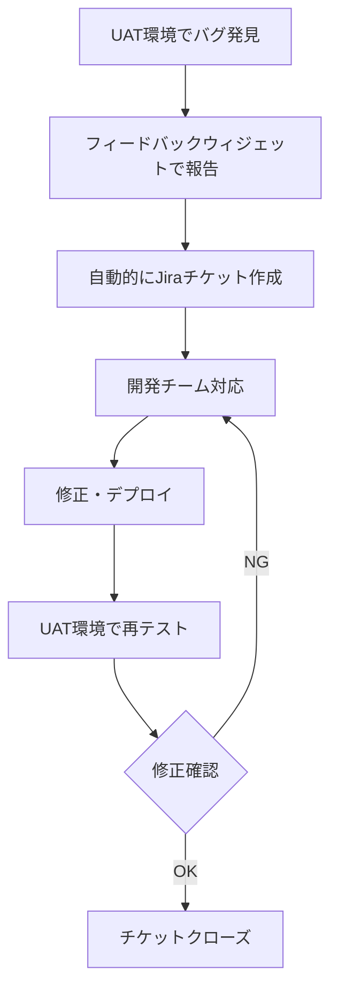

# UAT (ユーザー受け入れテスト) 環境設定

## 概要
ステークホルダーがこえポン！アプリケーションの品質確認を行うためのUAT環境を構築します。

## 1. UAT環境アクセス設定

### アクセス管理
```typescript
// middleware/uat-access-control.ts
import { NextRequest, NextResponse } from 'next/server'

const UAT_USERS = [
  'product-owner@company.com',
  'designer@company.com', 
  'business-analyst@company.com',
  'qa-lead@company.com',
  // 開発チーム
  'dev-team@company.com'
]

const UAT_DOMAIN_WHITELIST = [
  'company.com',
  'example.com', // テストドメイン
]

export function middleware(request: NextRequest) {
  // ステージング環境でのUATアクセス制御
  if (process.env.NODE_ENV === 'staging') {
    const auth = request.headers.get('authorization')
    const email = extractEmailFromAuth(auth)
    
    if (!email || !isAuthorizedUATUser(email)) {
      return new NextResponse('UAT Access Denied', { status: 403 })
    }
  }
  
  return NextResponse.next()
}

function isAuthorizedUATUser(email: string): boolean {
  return UAT_USERS.includes(email) || 
         UAT_DOMAIN_WHITELIST.some(domain => email.endsWith(`@${domain}`))
}
```

### OAuth認証設定（Supabase）
```sql
-- UAT専用認証ポリシー
INSERT INTO auth.providers (name, enabled) VALUES ('google', true);
INSERT INTO auth.providers (name, enabled) VALUES ('azure', true);

-- UAT用ドメイン制限
CREATE OR REPLACE FUNCTION auth.check_uat_domain()
RETURNS trigger AS $$
BEGIN
  IF NEW.email !~ '@(company\.com|example\.com)$' THEN
    RAISE EXCEPTION 'UAT access restricted to authorized domains';
  END IF;
  RETURN NEW;
END;
$$ LANGUAGE plpgsql;

CREATE TRIGGER uat_domain_check
  BEFORE INSERT ON auth.users
  FOR EACH ROW
  EXECUTE FUNCTION auth.check_uat_domain();
```

## 2. UAT支援機能実装

### デバッグパネル
```typescript
// components/uat/DebugPanel.tsx
'use client'
import { useState, useEffect } from 'react'
import { useAuth } from '@/hooks/useAuth'

interface DebugInfo {
  userInfo: any
  featureFlags: Record<string, boolean>
  apiResponseTimes: Record<string, number>
  dbQueryLogs: string[]
}

export function DebugPanel() {
  const [isOpen, setIsOpen] = useState(false)
  const [debugInfo, setDebugInfo] = useState<DebugInfo | null>(null)
  const { user } = useAuth()

  // UAT環境でのみ表示
  if (process.env.NODE_ENV !== 'staging') return null

  useEffect(() => {
    loadDebugInfo()
  }, [])

  const loadDebugInfo = async () => {
    const response = await fetch('/api/uat/debug-info')
    const data = await response.json()
    setDebugInfo(data)
  }

  return (
    <div className="fixed bottom-4 right-4 z-50">
      <button
        onClick={() => setIsOpen(!isOpen)}
        className="bg-orange-500 text-white px-4 py-2 rounded-lg shadow-lg hover:bg-orange-600"
      >
        🐛 Debug Panel
      </button>
      
      {isOpen && (
        <div className="absolute bottom-12 right-0 w-96 bg-white border shadow-xl rounded-lg p-4 max-h-96 overflow-y-auto">
          <div className="space-y-4">
            <div>
              <h3 className="font-bold text-gray-800">Current User</h3>
              <pre className="text-xs bg-gray-100 p-2 rounded">
                {JSON.stringify(user, null, 2)}
              </pre>
            </div>
            
            {debugInfo && (
              <>
                <div>
                  <h3 className="font-bold text-gray-800">Feature Flags</h3>
                  <div className="space-y-1">
                    {Object.entries(debugInfo.featureFlags).map(([flag, enabled]) => (
                      <div key={flag} className="flex justify-between text-sm">
                        <span>{flag}</span>
                        <span className={enabled ? 'text-green-600' : 'text-red-600'}>
                          {enabled ? '✅' : '❌'}
                        </span>
                      </div>
                    ))}
                  </div>
                </div>
                
                <div>
                  <h3 className="font-bold text-gray-800">API Response Times</h3>
                  <div className="space-y-1">
                    {Object.entries(debugInfo.apiResponseTimes).map(([endpoint, time]) => (
                      <div key={endpoint} className="flex justify-between text-sm">
                        <span className="truncate">{endpoint}</span>
                        <span className={time > 1000 ? 'text-red-600' : 'text-green-600'}>
                          {time}ms
                        </span>
                      </div>
                    ))}
                  </div>
                </div>
              </>
            )}
          </div>
        </div>
      )}
    </div>
  )
}
```

### フィードバック収集システム
```typescript
// components/uat/FeedbackWidget.tsx
'use client'
import { useState } from 'react'
import { toast } from 'sonner'

interface FeedbackData {
  type: 'bug' | 'feature' | 'ui' | 'performance'
  severity: 'low' | 'medium' | 'high' | 'critical'
  title: string
  description: string
  screenshot?: string
  userAgent: string
  currentUrl: string
  timestamp: string
}

export function FeedbackWidget() {
  const [isOpen, setIsOpen] = useState(false)
  const [feedback, setFeedback] = useState<Partial<FeedbackData>>({
    type: 'bug',
    severity: 'medium'
  })
  const [isSubmitting, setIsSubmitting] = useState(false)

  // ステージング環境でのみ表示
  if (process.env.NODE_ENV !== 'staging') return null

  const captureScreenshot = async () => {
    try {
      // @ts-ignore - html2canvas library
      const canvas = await html2canvas(document.body)
      return canvas.toDataURL('image/png')
    } catch (error) {
      console.error('Screenshot capture failed:', error)
      return null
    }
  }

  const submitFeedback = async () => {
    setIsSubmitting(true)
    
    try {
      const screenshot = await captureScreenshot()
      
      const feedbackData: FeedbackData = {
        ...feedback as FeedbackData,
        screenshot: screenshot || undefined,
        userAgent: navigator.userAgent,
        currentUrl: window.location.href,
        timestamp: new Date().toISOString()
      }

      const response = await fetch('/api/uat/feedback', {
        method: 'POST',
        headers: { 'Content-Type': 'application/json' },
        body: JSON.stringify(feedbackData)
      })

      if (response.ok) {
        toast.success('フィードバックを送信しました！')
        setIsOpen(false)
        setFeedback({ type: 'bug', severity: 'medium' })
      } else {
        throw new Error('Failed to submit feedback')
      }
    } catch (error) {
      toast.error('フィードバックの送信に失敗しました')
    } finally {
      setIsSubmitting(false)
    }
  }

  return (
    <>
      <button
        onClick={() => setIsOpen(true)}
        className="fixed bottom-16 right-4 bg-blue-500 text-white px-4 py-2 rounded-lg shadow-lg hover:bg-blue-600 z-50"
      >
        💬 Feedback
      </button>

      {isOpen && (
        <div className="fixed inset-0 bg-black bg-opacity-50 z-50 flex items-center justify-center p-4">
          <div className="bg-white rounded-lg p-6 w-full max-w-md">
            <div className="flex justify-between items-center mb-4">
              <h2 className="text-lg font-bold">フィードバック送信</h2>
              <button 
                onClick={() => setIsOpen(false)}
                className="text-gray-500 hover:text-gray-700"
              >
                ✕
              </button>
            </div>

            <div className="space-y-4">
              <div>
                <label className="block text-sm font-medium mb-1">種類</label>
                <select
                  value={feedback.type}
                  onChange={(e) => setFeedback({...feedback, type: e.target.value as any})}
                  className="w-full border rounded-lg px-3 py-2"
                >
                  <option value="bug">🐛 バグ報告</option>
                  <option value="feature">✨ 機能要望</option>
                  <option value="ui">🎨 UI/UX改善</option>
                  <option value="performance">⚡ パフォーマンス</option>
                </select>
              </div>

              <div>
                <label className="block text-sm font-medium mb-1">重要度</label>
                <select
                  value={feedback.severity}
                  onChange={(e) => setFeedback({...feedback, severity: e.target.value as any})}
                  className="w-full border rounded-lg px-3 py-2"
                >
                  <option value="low">🟢 低</option>
                  <option value="medium">🟡 中</option>
                  <option value="high">🟠 高</option>
                  <option value="critical">🔴 緊急</option>
                </select>
              </div>

              <div>
                <label className="block text-sm font-medium mb-1">タイトル</label>
                <input
                  type="text"
                  value={feedback.title || ''}
                  onChange={(e) => setFeedback({...feedback, title: e.target.value})}
                  placeholder="問題の概要を入力..."
                  className="w-full border rounded-lg px-3 py-2"
                />
              </div>

              <div>
                <label className="block text-sm font-medium mb-1">詳細説明</label>
                <textarea
                  value={feedback.description || ''}
                  onChange={(e) => setFeedback({...feedback, description: e.target.value})}
                  placeholder="詳細な説明、再現手順など..."
                  rows={4}
                  className="w-full border rounded-lg px-3 py-2"
                />
              </div>

              <div className="flex space-x-2">
                <button
                  onClick={() => setIsOpen(false)}
                  className="flex-1 border border-gray-300 rounded-lg py-2 px-4 hover:bg-gray-50"
                >
                  キャンセル
                </button>
                <button
                  onClick={submitFeedback}
                  disabled={isSubmitting || !feedback.title || !feedback.description}
                  className="flex-1 bg-blue-500 text-white rounded-lg py-2 px-4 hover:bg-blue-600 disabled:opacity-50"
                >
                  {isSubmitting ? '送信中...' : '送信'}
                </button>
              </div>
            </div>
          </div>
        </div>
      )}
    </>
  )
}
```

### テストデータ管理
```typescript
// lib/uat/test-data-manager.ts
import { createClient } from '@supabase/supabase-js'

const supabase = createClient(
  process.env.NEXT_PUBLIC_SUPABASE_URL!,
  process.env.SUPABASE_SERVICE_ROLE_KEY!
)

export class UATTestDataManager {
  
  // UAT専用テストデータリセット
  async resetUATData(): Promise<void> {
    if (process.env.NODE_ENV !== 'staging') {
      throw new Error('UAT data reset is only allowed in staging environment')
    }

    // トランザクションでデータリセット
    const { error } = await supabase.rpc('reset_uat_test_data')
    
    if (error) {
      throw new Error(`Failed to reset UAT data: ${error.message}`)
    }
  }

  // テストシナリオ別データ生成
  async generateTestScenario(scenario: string): Promise<void> {
    const scenarios = {
      'basic_user_flow': this.createBasicUserScenario,
      'gacha_flow': this.createGachaFlowScenario,
      'vtuber_management': this.createVTuberManagementScenario,
      'payment_flow': this.createPaymentFlowScenario
    }

    const generator = scenarios[scenario as keyof typeof scenarios]
    if (!generator) {
      throw new Error(`Unknown test scenario: ${scenario}`)
    }

    await generator.call(this)
  }

  private async createBasicUserScenario(): Promise<void> {
    // 基本ユーザーフロー用のテストデータ
    const testUsers = [
      {
        email: 'uat-newuser@example.com',
        password: 'NewUser123!',
        display_name: 'UAT新規ユーザー',
        medals_balance: 0
      },
      {
        email: 'uat-activeuser@example.com', 
        password: 'ActiveUser123!',
        display_name: 'UATアクティブユーザー',
        medals_balance: 10000
      }
    ]

    for (const user of testUsers) {
      await supabase.auth.admin.createUser({
        email: user.email,
        password: user.password,
        email_confirm: true,
        user_metadata: {
          display_name: user.display_name,
          medals_balance: user.medals_balance
        }
      })
    }
  }

  private async createGachaFlowScenario(): Promise<void> {
    // ガチャフロー用のテストデータ
    const { error } = await supabase.rpc('create_uat_gacha_scenario')
    if (error) throw error
  }

  private async createVTuberManagementScenario(): Promise<void> {
    // VTuber管理フロー用のテストデータ  
    const { error } = await supabase.rpc('create_uat_vtuber_scenario')
    if (error) throw error
  }

  private async createPaymentFlowScenario(): Promise<void> {
    // 決済フロー用のテストデータ（Stripe Test Mode）
    const { error } = await supabase.rpc('create_uat_payment_scenario')
    if (error) throw error
  }
}
```

## 3. UAT実施手順書

### Phase 1: 機能受け入れテスト (2日間)

#### Day 1: 基本機能テスト
- [ ] **ユーザー登録・ログイン**
  - [ ] 新規ユーザー登録
  - [ ] ログイン・ログアウト
  - [ ] パスワードリセット
  - [ ] プロフィール変更

- [ ] **ガチャ機能**
  - [ ] ガチャ一覧表示
  - [ ] 単発ガチャ実行
  - [ ] 10連ガチャ実行
  - [ ] 結果表示・演出

#### Day 2: 高度な機能テスト
- [ ] **推しメダル・交換所**
  - [ ] 残高表示
  - [ ] アイテム交換
  - [ ] 交換履歴確認

- [ ] **特典BOX**
  - [ ] 特典一覧表示
  - [ ] ダウンロード機能
  - [ ] プレビュー機能

### Phase 2: VTuber管理機能 (1日間)
- [ ] **VTuber申請**
  - [ ] 申請フォーム入力
  - [ ] ファイルアップロード
  - [ ] 審査状況確認

- [ ] **管理ダッシュボード**
  - [ ] 統計情報表示
  - [ ] ガチャ管理
  - [ ] 売上確認

### Phase 3: 管理者機能 (1日間)
- [ ] **システム管理**
  - [ ] ユーザー管理
  - [ ] VTuber審査
  - [ ] システム監視

### Phase 4: パフォーマンス・セキュリティ (0.5日間)
- [ ] **パフォーマンス確認**
  - [ ] ページ読み込み速度
  - [ ] ガチャ抽選速度
  - [ ] API応答速度

- [ ] **セキュリティ確認**
  - [ ] 認証・認可
  - [ ] データ保護
  - [ ] アクセス制御

## 4. UAT環境設定ファイル

### 環境変数設定
```bash
# .env.staging.uat
NODE_ENV=staging
NEXT_PUBLIC_ENVIRONMENT=uat

# UAT固有設定
ENABLE_DEBUG_PANEL=true
ENABLE_FEEDBACK_WIDGET=true
ENABLE_TEST_DATA_RESET=true
ENABLE_USER_SWITCHING=true

# UAT認証設定
UAT_ACCESS_ENABLED=true
UAT_DOMAIN_WHITELIST=company.com,example.com

# テスト用決済設定
STRIPE_PUBLISHABLE_KEY=pk_test_...
STRIPE_SECRET_KEY=sk_test_...
ENABLE_MOCK_PAYMENT=true

# Slack通知設定（UAT専用チャンネル）
SLACK_UAT_WEBHOOK_URL=https://hooks.slack.com/services/...
```

## 5. UAT完了基準

### 受け入れ基準
- ✅ 全機能テストケース合格率 > 95%
- ✅ クリティカルバグ 0件
- ✅ 高優先度バグ < 3件
- ✅ パフォーマンス要件満足
- ✅ セキュリティ要件満足

### ステークホルダー承認
- [ ] Product Owner承認
- [ ] UI/UX Designer承認  
- [ ] Business Analyst承認
- [ ] QA Lead承認
- [ ] 技術責任者承認

## 6. UAT環境からのフィードバック処理

### バグ報告ワークフロー


このUAT環境設定により、ステークホルダーが効率的に品質確認を行える環境が整います。